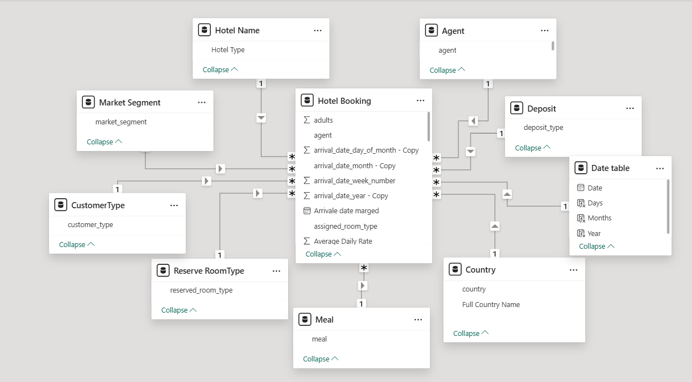
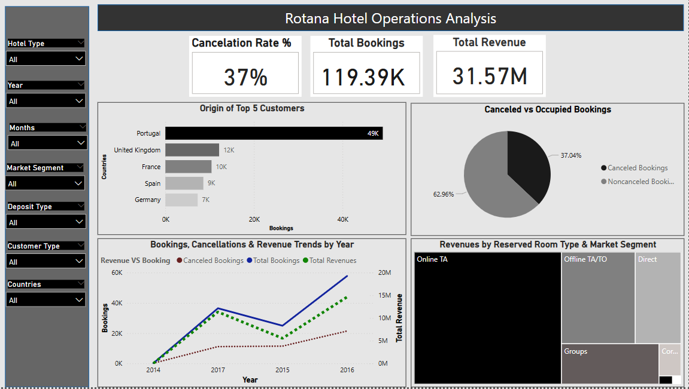
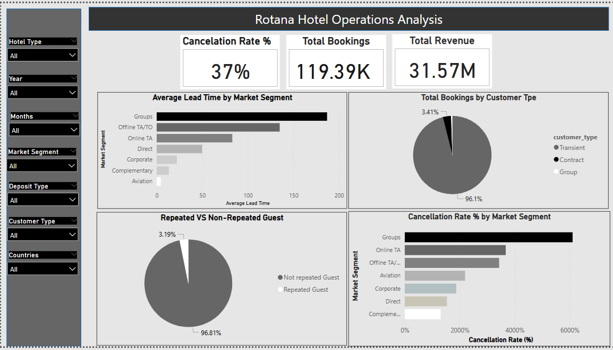

# Hotel-Operations-Analysis

## Introduction 
The hospitality industry is highly competitive and data-driven. With increasing online bookings, changing customer behaviors, and the impact of cancellations on revenue, hotels need smart insights to optimize their operations, pricing, and marketing strategies. This project analyzes hotel booking data to uncover trends in customer behavior, booking patterns, and revenue generation.

Using tools like Excel, SQL Server, and Power BI, the dataset is cleaned, explored, and visualized to help stakeholders make informed decisions. Key areas of focus include booking trends, cancellation patterns, seasonal performance, customer segmentation, and revenue insights.

## Problem Statement
Hotel businesses often face challenges such as high cancellation rates, inconsistent revenue flow across seasons, and limited visibility into customer booking behaviors. Without proper analysis, it's difficult to:

- Identify which segments contribute most to revenue.

- Optimize room pricing and marketing strategies.

- Anticipate customer demand across different times of the year.
  
The goal of this analysis is to explore hotel booking data and uncover actionable insights that can help:

## Data Cleaning 
The dataset was cleaned by standardizing column names, fixing inconsistencies in text and dates, and handling missing values such as replacing blanks in the children column with 0 and undefined meal entries with the mode. Additional improvements included correcting week numbers, adding a Booking ID, converting country codes to full names, and replacing zero adr values with the average. Finally, the file was converted to a UTF-8 CSV for SQL compatibility, ensuring a structured and analysis-ready dataset.

## Modeling 
The model is a star schema.
There are 9-dimension tables and 1 fact table. The dimension tables are all joined to the fact table one 
to-many relationship.

## Visualization
The visualizations present key insights into customer behavior, booking trends, and revenue performance. Through interactive charts, they support data-driven decisions to optimize hotel operations and marketing strategies.

  
### Slicers (on the left panel)
These allow users to filter data by hotel type, year, month, market segment, deposit type, customer type, and country – enabling interactive and dynamic exploration of the dashboard.

### Top KPIs (Cards at the Top)
- Cancelation Rate % (37%):
Shows that 37% of all bookings were canceled – a significant portion, which could point to a customer trust or policy issue.

- Total Bookings (119.39K):
  Indicates the total number of bookings made across the dataset.

- Total Revenue (31.57M):
Reflects the total income generated from all bookings.

### Origin of Top 5 Customers
This bar chart gives us a clear picture of where our top five customers are coming from. It looks like Portugal is by far our biggest source of bookings among this group, with a whopping 49,000+ bookings. The United Kingdom comes in second, but with a significantly lower number, around 12,000 bookings. Following the UK, we have France with approximately 10,000 bookings, then Spain with about 9,000, and finally Germany rounding out the top five with around 7,000 bookings. This really highlights Portugal as a key market for us within our top customer base.

### Bookings, Cancellations & Revenue Trends by Year
From 2014 to 2016, we observed strong year-over-year growth in total bookings and revenue, culminating in a peak in 2016 with approximately 58,000 bookings and over $14.6 million in revenue. However, 2016 also recorded the highest number of cancellations, exceeding 21,000. In 2017, both bookings and revenue declined, accompanied by a decrease in cancellations. This trend indicates a potential shift in business dynamics following the 2016 peak.

### Revenues by Reserved Room Type & Market Segment

Combining the insights from the market segment and room type revenue analyses provides a clearer view of the key drivers behind our overall performance, the "Online TA" segment emerged as the top revenue contributor. When we break down revenue by reserved room type, Room Type "A" stands out significantly, generating $18.3 million, making it the single largest contributor to total revenue.

### Canceled vs Occupied Bookings 
This pie chart shows us the proportion of bookings that were canceled versus those that were not. The black slice represents the canceled bookings, which make up 37.04% of the total. On the other hand, the larger gray slice shows the non-canceled bookings, accounting for the majority at 62.96%. So, for every 100 bookings, roughly 37 were canceled, and about 63 proceeded as planned.

### Average Lead Time by Market Segment
This horizontal bar chart displays the average lead time (in days) for bookings across various market segments. Group and offline travel agency bookings have the longest lead times, indicating early planning, while corporate, complimentary, and aviation bookings are often last-minute. Online and direct bookings fall in between. These patterns highlight the need for segment-specific strategies in forecasting, inventory management, and customer communication.

